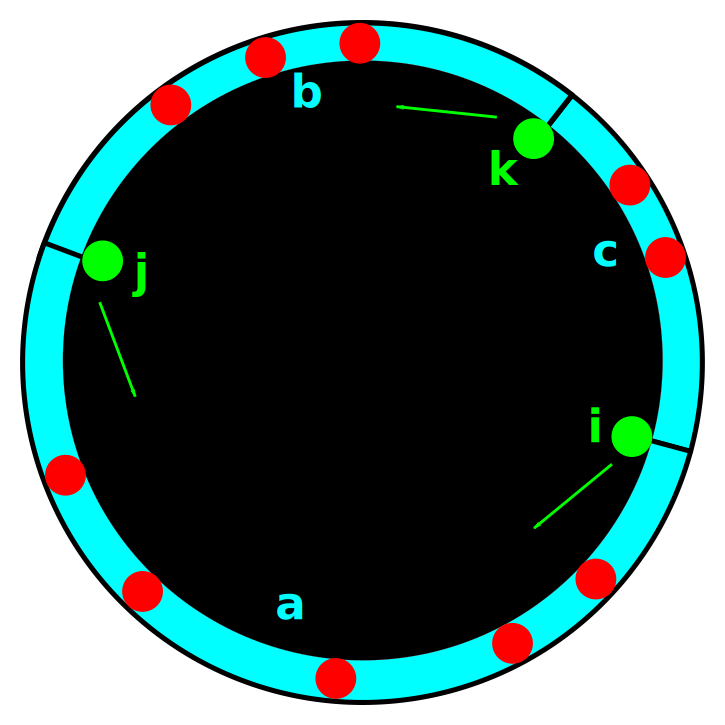
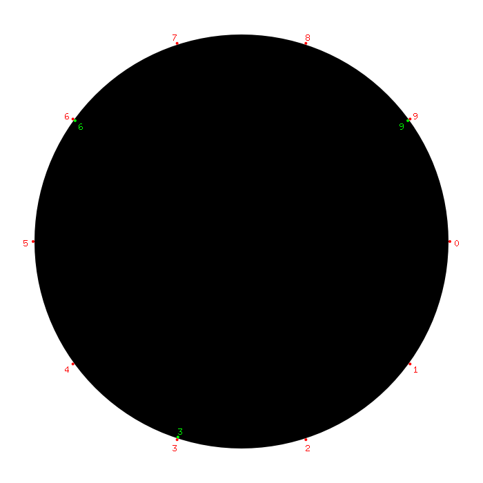
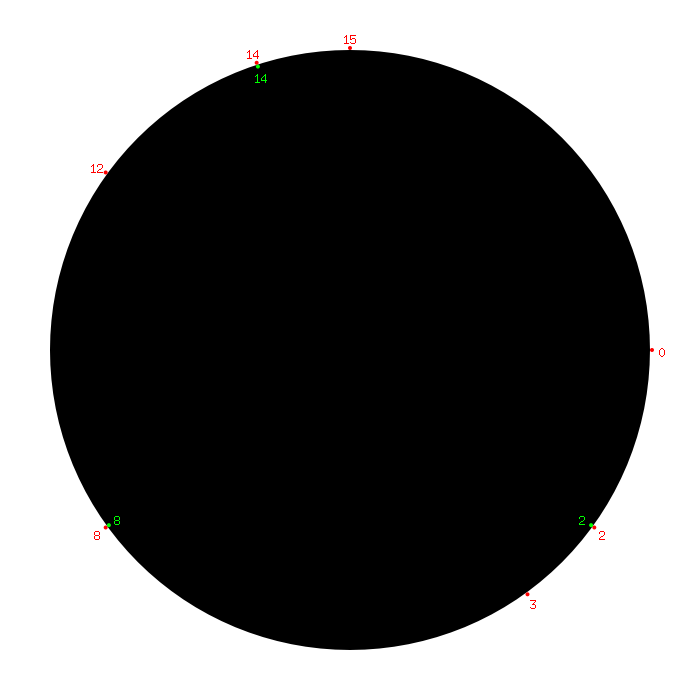
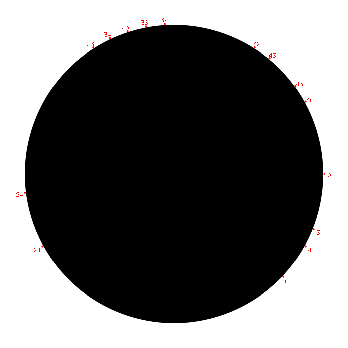
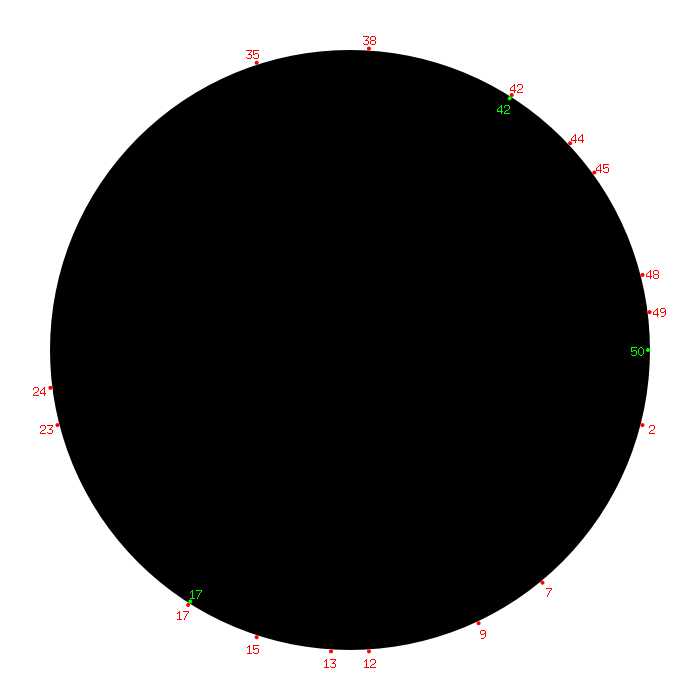
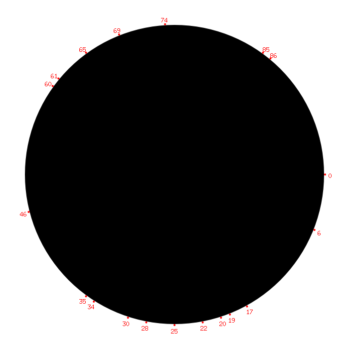
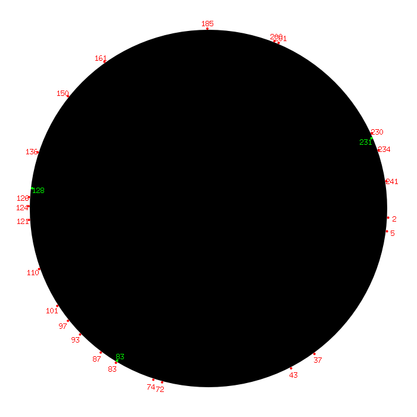
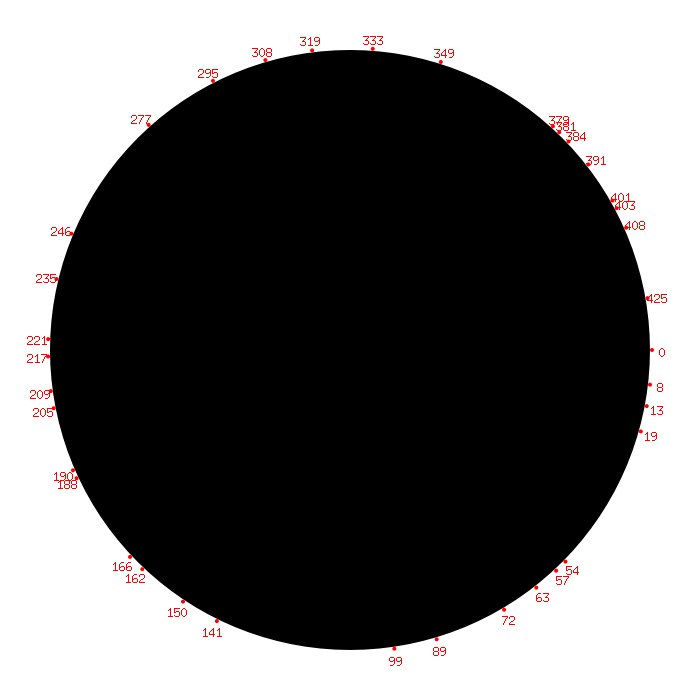
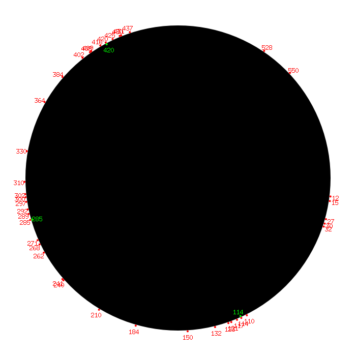

# Lösung "Eisbudendilemma"

Lars Müller, Teilnahme-ID 58886

# Lösungsidee

Man beginnt mit einer naiven Brute-Force: Probiere alle möglichen Eisbudenstandorte; prüfe für jeden, ob er *stabil* ist - also gegen alle anderen möglichen Standorte in einer Abstimmung gewinnen würde.

Die Komplexität hiervon wäre entsprechend polynomiell $u^6n$ für $u$ Umfang und $n$ Anzahl der Adressen: Das Probieren aller Standorte ist $u^3$; für jeden Standort müssten wieder alle Standorte durchgegangen werden, also $u^6$. Schließlich müssen jeweils die beiden Standorte verglichen werden. Hierfür müssen alle $n$ Adressen iteriert werden.

Erste Optimierung: Gehe die Standorte $i, j, k$ so durch, dass $i < j < k$ gilt. Anstatt von $u^6$ Schleifendurchläufen erhalten wir so $(\frac{u(u-1)(u-2)}{3!})^2$ Schleifendurchläufe.

Zweite Optimierung: Gehe $i, j, k$ so durch, dass zwischen $i$ und $j$ sowie $j$ und $k$ jeweils mindestens ein Drittel der Häuser liegen. Beweis: Zwischen $i$ und $j$ (beide exklusive) befinden sich $a$ Häuser, zwischen $j$ und $k$ $b$, sowie zwischen $k$ und $i$ $c$. Seien $i, j, k$ so gewählt, dass $a \geq b \geq c$. Dann verlegen wir einfach $i$ und $j$ auf einander zu, so dass alle $a$ Häuser für die Verlegung stimmen würden. Wir können nun $k$ so verlegen, dass auch mindestens die Hälfte der $\lfloor\frac{b}{2}\rfloor$ Häuser für die Verlegung stimmen würden. Für $a$ > $\lfloor\frac{n}{3}\rfloor$ ist die Summe der Stimmen offensichtlich eine Mehrheit, die Standorte $i, j, k$ können nicht stabil sein.

{width=50%}

Wir haben allerdings Häuser, die exakt gleiche Adressen wie die Eisdielen besitzen, vernachlässigt; diese würden womöglich alle drei gegen die Verlegung stimmen. Entsprechend addieren wir einfach $3$: Für $a$ > $\lfloor\frac{n}{3}\rfloor + 3$ können die Standorte nicht stabil sein.

Die Prüfung, ob die Standorte stabil sind, lässt sich mithilfe einer Serie von Tests weiter optimieren. Sobald die zu testenden Standorte gegen einen anderen Standortvorschlag verloren haben, kann die Prüfung abgebrochen werden:

1. Probiere Verlegungen der Standorte um eine Adresse in oder gegen den Uhrzeigersinn
2. Probiere gegenüber von Häusern platzierte Eisbudenstandorte.
3. Probiere schließlich alle anderen Eisbudenstandorte gemäß der zweiten Optimierung.

Bestehen Standorte die dritte Prüfung, sind sie stabil.

Sobald man eine Lösung gefunden hat, ist man fertig und kann abbrechen. Möchte man allerdings die "beste" Lösung - mit einer minimalen Summe der Abstände der Dorfbewohner zu den nächsten Eisdielen finden - müssen weiter Lösungen gesucht werden. Dennoch steigt die Laufzeit nicht zu sehr, denn man erhält die besagte Summe auch als Abbruchkriterium.

## Umsetzung

### Kompilierung

Go 1.13 oder neuer benötigt. `go build` (erzeugt eine ausführbare Datei namens `Eisbudendilemma`) oder `go build main.go` (nennt die Datei `main`). Die vorkompilierte ausführbare Datei ist für Linux.

### Verwendung

`go run main.go <pfad> [beste-loesung] [png-ausgabe-pfad]` oder `./main <pfad> [beste-loesung] [png-ausgabe-pfad]`: Erstes Argument ist der Pfad zur Datei. Das zweite Argument ist optional und gibt an, ob die beste Lösung ermittelt werden soll; Standardwert ist `j` für "ja", auch möglich ist `n` für "nein". Das dritte Argument ist ebenfalls optional und gibt einen Pfad für eine Bildausgabe an; wird es weggelassen, wird kein Bild erstellt. Wird das dritte Argument angegeben, muss auch das Zweite angegeben werden.

Beispiel: `./main beispieldaten/eisbuden0.txt`

### Ausgabeformat

```
Keine Lösung möglich
```

oder

```
Lösung: Adressen [...]
```

oder (wenn `beste-loesung` auf "ja" gesetzt ist)

```
Lösung: Adressen [...] mit Summe der Abstände ...
```

### Bibliotheken

Go-Sprachbibliotheken ("builtins"):
* `bufio`: `Scanner`
* `fmt`: Ausgabe, Formattierung
* `math`: Maxima
* `os`: Argumente
* `sort`: Sortierung der Adressen (keine Reihenfolge zugesichert), binäre Suche
* `strconv`: Zahl-String-Konversion
* `strings`: Stringverarbeitung ("splitten")
* `sync`: Parallelisierung (`WaitGroup`, `Mutex`)

Externe Bibliothek (Installation über `go get github.com/fogleman/gg`):
* `github.com/fogleman/gg`: Zeichenbibliothek

### Parallelisierbarkeit

Als optimierte Brute-Force lässt sich das Verfahren gut parallelisieren: Für jede Start-Eisbude mit Adresse $i$ wird eine parallel laufende "Goroutine" (eine Art "leichtgewichtiger Thread") gestartet, in der Eisbudenstandorte $i, j, k$ probiert werden.

### Ablauf

Das Ausprobieren erfolgt parallel. Die Funktion `istLoesung` bestimmt möglichst schnell, ob die übergebenen Standorte instabil sind; `getNaechsteAdresse` ermittelt zu einer Eisbuden-Adresse die nächste Adresse, bei der beginnend wieder eine Eisbude gesetzt werden kann, so dass die notwendigen Abstände eingehalten werden. Lösungen benötigen einen "Mutex", um nacheinander verglichen zu werden; ein "paralleler" Vergleich könnte zu "race-condition" Fehlern führen. Soll die erstgefundene Lösung ausgegeben (und gezeichnet) werden, verhindert der Mutex die Ausgabe (und Zeichnung) weiterer Lösungen.

## Quellcode

### `main.go`

```file:go
main.go
```

## Beispiele

Die verstrichene Zeit wurde nicht vom Programm selber, sondern von einem Shellscript gemessen.

### `eisbuden0.txt`

Zusätzliches Beispiel:

```file:
beispieldaten/eisbuden0.txt
```

```file:
loesungen/eisbuden0.txt
```



Das Beispiel dient als "sanity-check": Stabile Eisbudenstandorte liegen auf der Hand.

### `eisbuden1.txt`

```file:
loesungen/eisbuden1.txt
```



### `eisbuden2.txt`



```file:
loesungen/eisbuden2.txt
```

### `eisbuden3.txt`

```file:
loesungen/eisbuden3.txt
```



### `eisbuden4.txt`



```file:
loesungen/eisbuden4.txt
```

### `eisbuden5.txt`

```file:
loesungen/eisbuden5.txt
```



### `eisbuden6.txt`



```file:
loesungen/eisbuden6.txt
```

### `eisbuden7.txt`

```file:
loesungen/eisbuden7.txt
```



Die Laufzeiten reichen in meiner Umgebung von kurzen Laufzeiten bei kleinen Beispielen im Sekundenbereich bis hin zum Minutenbereich bei den größeren Beispielen.